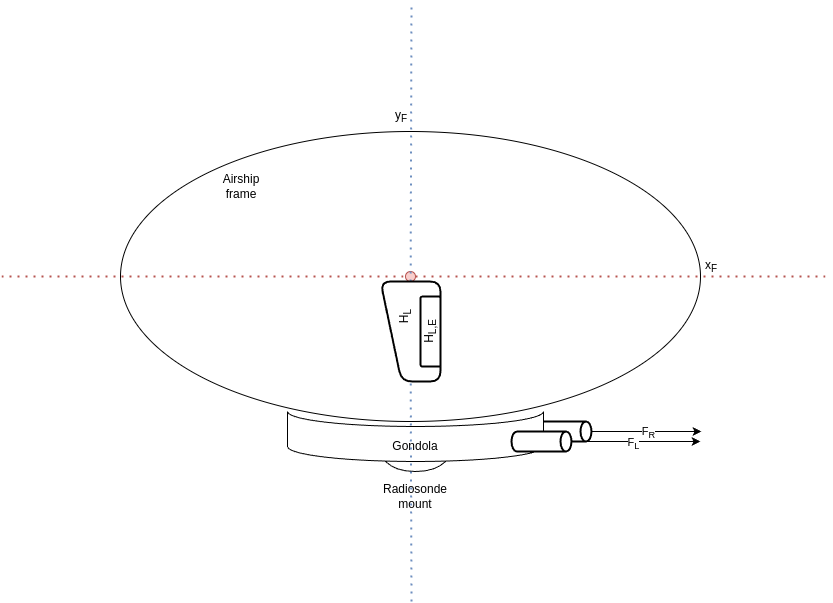
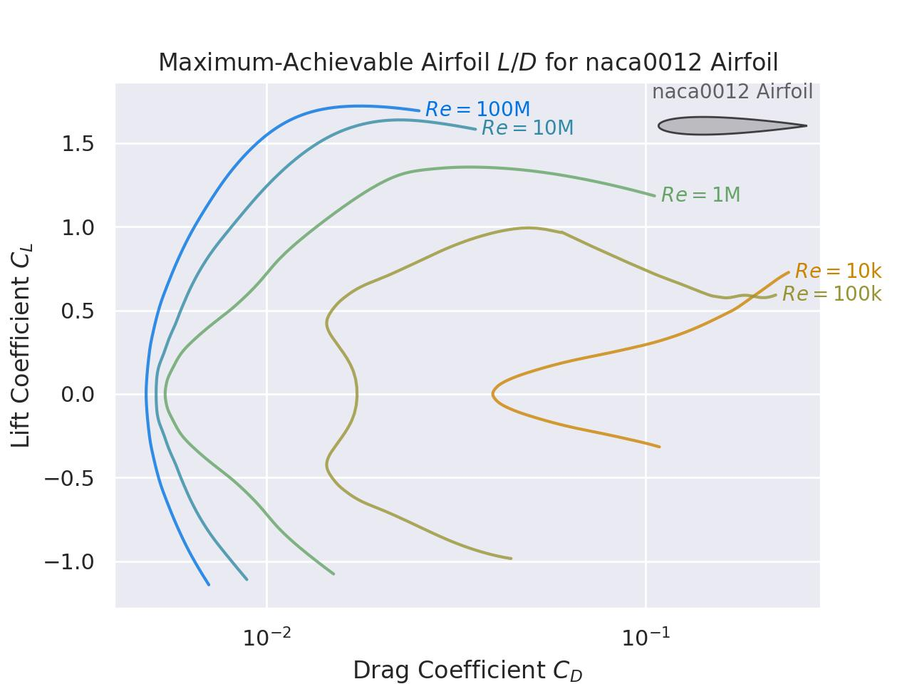
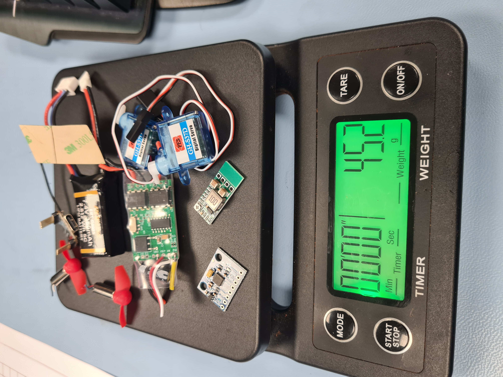

# hydroblimp
Making a hydrogen generator and a remote control mini blimp.

## Blimp design

<p align="middle">
  
   
  
</p>

### ENME 488 Flight Mechanics
A 6 degrees of freedom model was constructed for a high altitude research blimp.
The blimp was subjected to different external forces, representative of its operating point at ~30,000 ft.

Full report is `ENME488_Flight_Mechanics_Assignment.pdf`
Work mostly done in `modeling` folder. Outputs are in `report`.

This work was used for my Special Topic: Mechanics of Flight and Spaceflight paper at the University of Canterbury, which I received an A grade for.

### Future work
**Design:**

Improving the design at the operating point and perhaps some CFD to check feasibility.

**Embedded systems:**

Controls and propulsion has been started in the `control_software` repository.
The goal is to make an android app to load a flight path to the blimp. Some overlap with my rocket flight computer TBD, though that only has instrumentation, no controls.


### Python setup

```
# install python however you want, I use 3.10 on Ubuntu;
sudo add-apt-repository ppa:deadsnakes/ppa
sudo apt install python3.10-venv

# venv
python3.10 -m venv .venv
source .venv/bin/activate

# install required packages
pip install -r requirements.txt

# Install simupy;
git submodule update --init --recursive
cd simupy-flight/
python -m pip install .
```

## Hydrogen generator
-- TO BE CONTINUED, 2025 --

Use electrolysis as our generation method. Further details in `/hydro`.

- 3d printed mount (Need to use ABS not PLA)
- Some guesses at expected yield.